<div align="center">

<picture>
  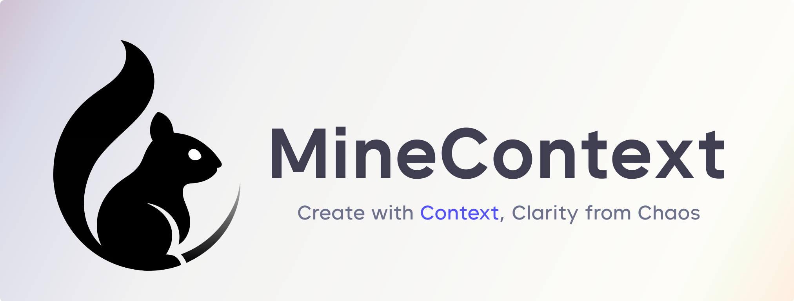
</picture>

### MineContext：洞察本质，激发创造

一个开源、主动的上下文感知 AI 伙伴，致力于让您的工作、学习与创作更加清晰高效。

中文 / [English](README.md)

<a href="https://bytedance.larkoffice.com/wiki/Hn6ewRnAwiSro7kkH6Sc1DMFnng">社区实践</a> · <a href="https://github.com/volcengine/MineContext/issues">反馈问题</a> · <a href="https://bytedance.larkoffice.com/share/base/form/shrcn2wgAfiyCVVwhvVYCXWNNdc">提交问卷</a>

[![][release-shield]][release-link]
[![][github-stars-shield]][github-stars-link]
[![][github-issues-shield]][github-issues-shield-link]
[![][github-contributors-shield]][github-contributors-link]
[![][license-shield]][license-shield-link]  
[![][last-commit-shield]][last-commit-shield-link]
[![][wechat-shield]][wechat-shield-link]

<a href="https://trendshift.io/repositories/15157" target="_blank"></a>

👋 加入我们的 [微信 / 飞书 / 小红书交流群](https://bytedance.larkoffice.com/wiki/Hg6VwrxnTiXtWUkgHexcFTqrnpg)

🌍 加入我们的 [Discord 社区](https://discord.gg/tGj7RQ3nUR)

<code>./scripts/package-macos-tauri.sh</code> 构建本仓库的 macOS 产物（未签名 dmg）· 上游发布见 <a href="https://github.com/volcengine/MineContext/releases">Releases</a>

</div>
  
目录

- [👋🏻 MineContext 是什么](#-minecontext-是什么)
- [🚀 核心功能](#-核心功能)
- [🔏 隐私保护](#-隐私保护)
  - [本地存储](#本地存储)
  - [本地模型](#本地模型)
- [🏁 快速开始](#-快速开始)
  - [1. 安装](#1-安装)
  - [2. 输入您的 API 密钥](#2-输入您的-api-密钥)
  - [3. 开始记录](#3-开始记录)
  - [4. 忘掉它](#4-忘掉它)
  - [5. 后台调试](#5-后台调试)
- [🎃 贡献指南](#-贡献指南)
  - [🎨 前端架构](#-前端架构)
    - [核心技术栈](#核心技术栈)
    - [核心架构](#核心架构)
  - [💻 前端使用](#-前端使用)
    - [构建后端](#构建后端)
    - [安装依赖](#安装依赖)
    - [开发调试](#开发调试)
    - [应用打包](#应用打包)
  - [🏗️ 后端架构](#️-后端架构)
    - [核心架构组件](#核心架构组件)
    - [各层职责](#各层职责)
  - [🚀 后端使用](#-后端使用)
    - [安装](#安装)
    - [配置](#配置)
    - [运行服务器](#运行服务器)
- [💎 MineContext 与我的世界](#-minecontext-与我的世界)
- [🎯 目标用户](#-目标用户)
- [🔌 上下文来源](#-上下文来源)
- [🆚 与同类应用的比较](#-与同类应用的比较)
  - [MineContext vs ChatGPT Pulse](#minecontext-vs-chatgpt-pulse)
  - [MineContext vs Dayflow](#minecontext-vs-dayflow)
- [👥 社区](#-社区)
  - [社区与支持](#社区与支持)
- [Star History](#star-history)
- [📃 许可证](#-许可证)

<br>

> **🔗 相关项目**：欢迎了解 **[OpenViking](https://github.com/volcengine/OpenViking)** - 一个专为 AI Agents 设计的开源上下文数据库。OpenViking 通过"文件系统范式"统一管理记忆、资源和技能三类上下文，为复杂的上下文管理提供基础设施层。

<br>

# 👋🏻 MineContext 是什么

MineContext 是一个具有上下文感知能力的主动式 AI 伙伴。它基于屏幕截图+内容理解的方式（未来还将支持其他来源的多模态信息，包括文档、图片、视频、代码、外部应用数据），能够看到并看懂用户的数字世界上下文，然后再基于底层的上下文工程框架，主动推送洞察、日/周总结 、待办、活动记录等高质量信息，同时支持用户基于 Context 和生成的信息进行再创作。

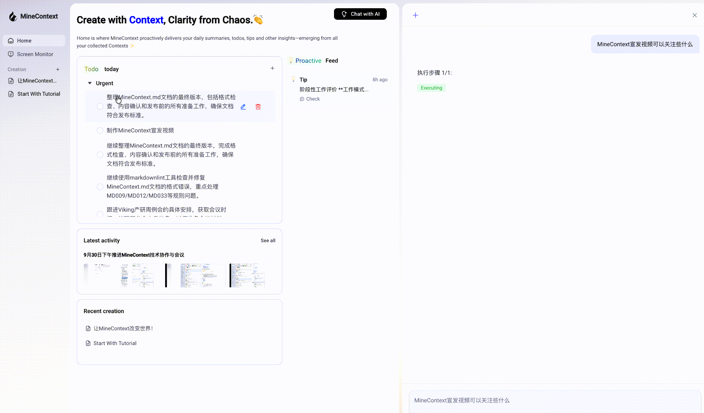

# 🚀 核心功能

MineContext 专注于四个核心功能：无负担收集、主动推送、智能浮现和上下文工程架构。

1. 📥 无负担收集
   支持收集和处理海量的 Context，并通过设计存储管理来实现海量收集却没有心智负担。
2. 🚀 主动推送
   支持日常主动推送关键信息和洞见，能够提炼 Context 中的总结信息，比如每日总结，每周总结，tips，todo，主动推送到主页。
3. 💡 智能浮现（实现中）
   支持创作时智能浮现，可以随时浮现相关有用的 Context，确保辅助创作又不会被淹没
4. 🎯 上下文工程架构
   支持多模态、多源数据的完整生命周期——从捕获、处理和存储到管理、检索和消费——支持生成六种类型的智能上下文。

# 🔏 隐私保护

## 本地存储

MineContext 非常注重用户隐私，所有数据都默认保存在本地如下路径，确保您的隐私和安全。

```
~/Library/Application Support/MineContext/Data
```

## 本地模型

此外我们支持了 OpenAI API 协议的自定义模型服务，您可以在 MineContext 中使用全本地模型，做到任何数据不上云。

# 🏁 快速开始

## 1. 安装

点击 [Github Latest Release](https://github.com/volcengine/MineContext/releases) 下载最新版本。

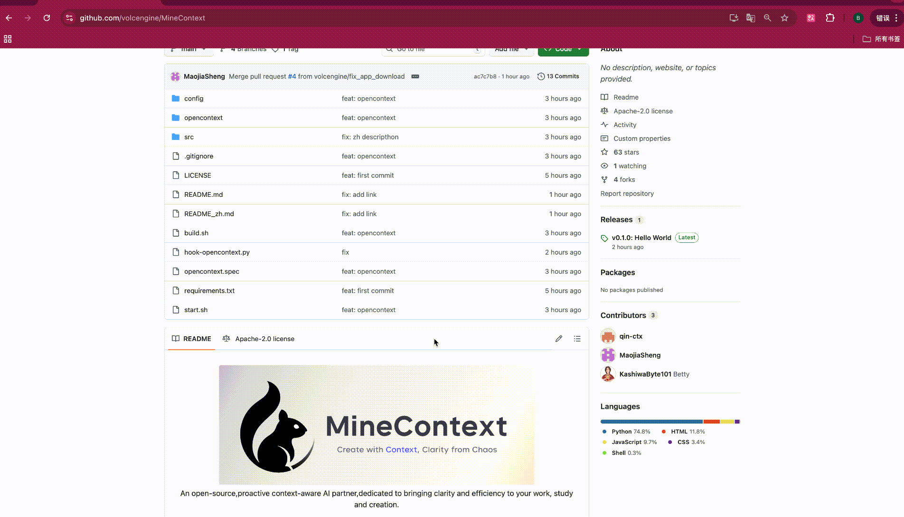

> **注意**：当前分发的 macOS `.dmg` **未签名、未公证**。若打开时提示「已损坏」或无法验证开发者，先清除隔离属性后再打开：
>
> ```bash
> xattr -cr ~/Downloads/MineContext_*.dmg
> # 若已拖到「应用程序」：
> xattr -dr com.apple.quarantine /Applications/MineContext.app
> ```
>
> 或对 `.app` 右键 →「打开」。有 Apple Developer ID 并完成公证后，可去掉上述步骤。

## 2. 输入您的 API 密钥

应用程序启动后（首次运行时需要安装后端环境，约需等待两分钟），请根据引导输入您的 API 密钥。目前我们支持豆包、OpenAI 以及自定义模型服务，包括任何兼容 OpenAI API 格式的**本地模型**或**第三方模型**服务。
我们推荐使用 [LMStudio](https://lmstudio.ai/) 来运行本地模型，它提供了简单的界面和强大的功能，能够帮助您快速部署和管理本地模型。

**综合成本和性能，我们推荐使用豆包模型**，豆包模型的 API-Key 可以在 [API 管理界面](https://console.volcengine.com/ark/region:ark+cn-beijing/apiKey) 生成。

获取豆包 API 之后需要在 [模型开通管理界面](https://console.volcengine.com/ark/region:ark+cn-beijing/model) 开通视觉语言模型和向量化两个模型。

- 视觉语言模型：Doubao-Seed-1.6-flash
  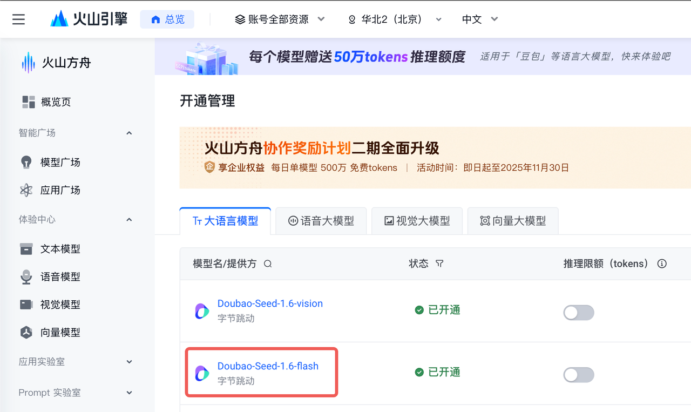

- 向量化模型：Doubao-embedding-vision
  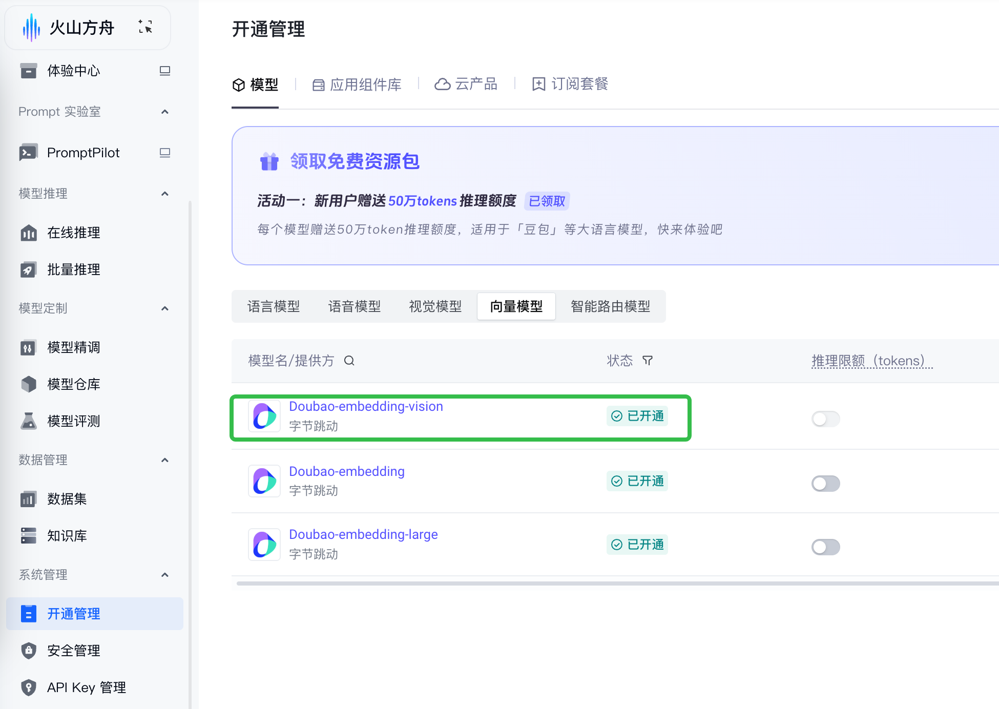

以下是获取了 API Key 后的填写流程：
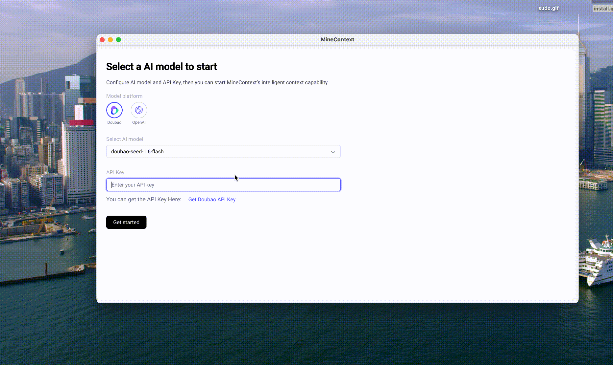

## 3. 开始记录

进入【Screen Monitor】启用屏幕分享的系统权限，设置完之后需要重新启动应用使其生效。

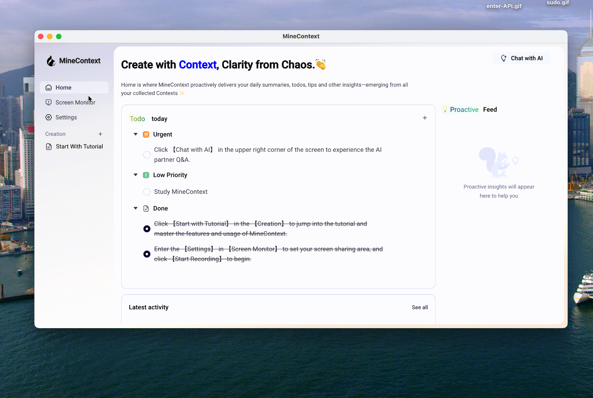

重新启动应用后，请先在【Settings】设置您的屏幕共享区域，然后点击【Start Recording】开始截图。

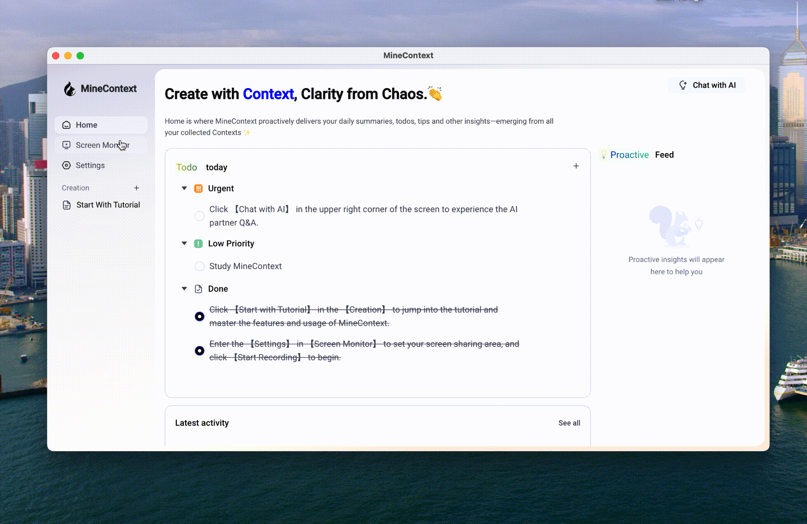

## 4. 忘掉它

启动记录后，您的上下文将逐渐被收集。这会需要一些时间才能产生价值。所以说，忘记它，安心专注于其他任务吧。MineContext 将会在后台为您生成待办事项、提示、摘要和活动。当然，您也可以通过【Chat with AI】进行主动问答。

## 5. 后台调试

MineContext 支持在`http://localhost:1733` 进行后台调试。

1.支持查看 Token 用量与使用情况

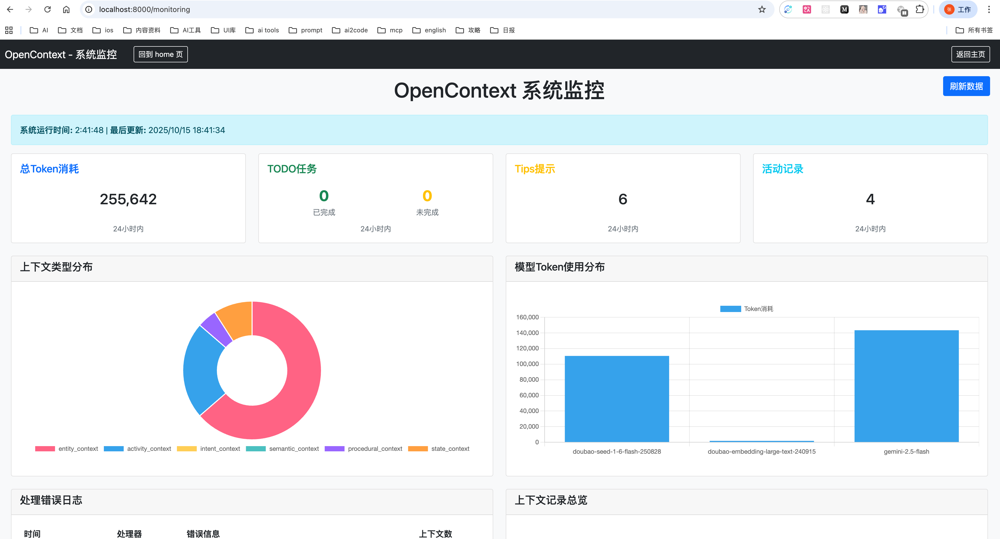

2.支持主动推送任务的时间间隔设置

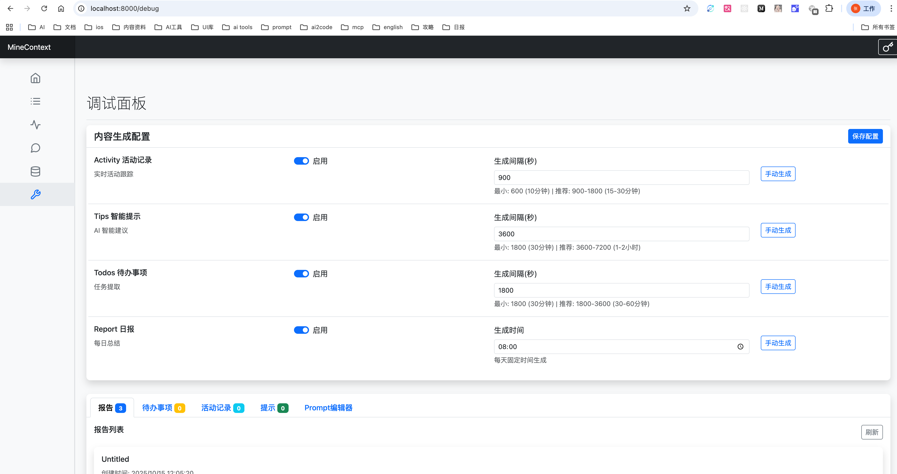

3.支持调整主动推送任务的系统提示词

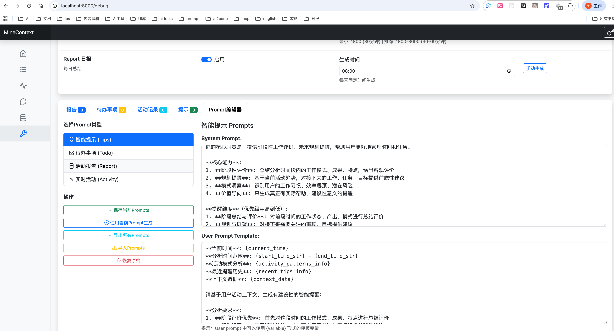

> **交付形态（本仓库）**：Rust 守护进程 `mc-daemon` + **Tauri 2** 桌面外壳，
> 渲染层是纯 `vite` 产物；没有 Python 后端，也没有 Electron 主进程。
> 构建、验证、排障、发布清单见 [`docs/operations.md`](docs/operations.md)，
> 架构与取舍见 [`docs/architecture.md`](docs/architecture.md)。
> 页面上的下载按钮指向**上游发布**；本工作树自己的产物是**未签名** dmg，
> 用 `./scripts/package-macos-tauri.sh` 构建（签名与公证见 docs/operations.md §5）。

# 🎃 贡献指南

## 🎨 前端架构

MineContext 前端是一个跨平台桌面应用：**Tauri 2** 外壳（Rust）承载 React + TypeScript 渲染层，渲染层通过本机 HTTP + SSE 与 `mc-daemon` 通信。

### 核心技术栈

| 技术         | 描述                                          |
| ------------ | --------------------------------------------- |
| Tauri 2      | 桌面外壳：窗口、托盘、单实例锁、daemon 生命周期与打包。 |
| React        | 用于构建动态用户界面的基于组件的 UI 库。      |
| TypeScript   | 提供静态类型检查，增强代码可维护性。          |
| Vite         | 渲染层构建工具（纯 `vite`，产物落在 `frontend/out/renderer`）。 |
| Tailwind CSS | 用于快速且一致地设计 UI 的实用优先 CSS 框架。 |
| pnpm         | 适用于 monorepo 项目的快速高效的包管理器。    |

### 核心架构

外壳与渲染层之间只有一条约定：`runtime.json`（端口 + token），由 `mc-daemon` 写出、外壳读取并经初始化脚本注入 `window.mcRuntime`。渲染层的适配层把渠道调用改成 HTTP/SSE，业务代码不 import 任何外壳 API。

```
crates/         # Rust workspace：domain / storage / capture / pipeline / server …
apps/           # mc-daemon（后端入口）与 mc-cli（运维命令）
src-tauri/      # Tauri 2 外壳（独立 crate，tauri 依赖不进根门禁）
frontend/
├── src/renderer/   # React 界面 + 适配层（渠道调用 → HTTP/SSE）
├── packages/shared # 共享配置、渠道枚举、渲染层日志
├── out/renderer/   # vite 产物 = Tauri 的 frontendDist（git 忽略）
└── scripts/        # 前端侧构建辅助脚本
scripts/        # 门禁（verify-all.sh）、打包、守卫、测试
```

1、Tauri 外壳（src-tauri/）负责：

- 拉起/停止 `mc-daemon`，等它写出 `runtime.json`
- 窗口、托盘（显示窗口 / 退出）、关窗收进托盘、单实例锁、开机自启
- 注入 `window.mcRuntime`，让渲染层找得到 daemon

2、适配层（src/renderer/src/adapters/）负责：

- 把渠道调用映射成 daemon 的 HTTP 请求与 SSE 订阅
- 逐项安装业务代码在用的旧全局（`dbAPI`、`screenMonitorAPI` …）
- 没有实现的渠道**明确报错/告警**，不留静默 no-op

3、渲染层（src/renderer/）负责：

- 实现基于 React 的用户界面
- 使用 Jotai 与 Redux 管理全局状态
- 基于 Tailwind CSS 的高效样式体系
- 动态加载与性能优化机制

4、构建与打包：

- `frontend/vite.config.mts` — 渲染层构建（`root`、`base: './'`、`outDir` 与 Tauri 的 `frontendDist` 对齐）。
- `./scripts/package-macos-tauri.sh` — release daemon → 渲染层 → `cargo tauri build` → 产物启动检查（未签名 dmg）。

## 💻 开发与运行

### 环境

| 需要 | 版本 | 说明 |
| --- | --- | --- |
| Rust | 1.97+ | 工作区在 `crates/` 与 `apps/`，外壳在 `src-tauri/` |
| Node.js | 20+ | 渲染层构建与测试 |
| pnpm | 9+ | 渲染层依赖管理 |

macOS 还需要 Xcode Command Line Tools（截图与窗口元数据用到系统框架）。

### 安装依赖

```bash
cargo fetch                # Rust 依赖
cd frontend && pnpm install # 渲染层依赖
```

### 一次跑起来（开发）

```bash
# 1) 构建并跑守护进程（daemon 会把端口与 token 写进 runtime.json）
cargo run -p mc-daemon

# 2) 另开一个终端：只跑渲染层（vite dev server，端口 5173）
cd frontend && pnpm dev

# 3) 想要「外壳 + 渲染层 + daemon」一起跑（真实形态）
cargo tauri dev --manifest-path src-tauri/Cargo.toml
```

本地开发时截屏目标枚举较慢属正常现象（首次调用要问系统要显示器与窗口列表）。

### 构建 macOS 安装包

一键（推荐，含产物启动检查）：

```bash
./scripts/package-macos-tauri.sh
# 产物：src-tauri/target/release/bundle/dmg/MineContext_<版本>_<arch>.dmg
```

分步做（想自己控制每一步时）：

```bash
cargo build --release -p mc-daemon            # 守护进程（打包要用的二进制）
cd frontend && pnpm install && pnpm build     # 渲染层（产物在 frontend/out/renderer）
cd ../src-tauri
cargo tauri build --bundles dmg \
  --config '{"bundle":{"resources":{"../target/release/mc-daemon":"backend/mc-daemon"}}}'
# 只要 .app（不压 dmg）：--bundles app
```

产物是**未签名未公证**的（本仓库没有 Developer ID），首次打开需要在
「系统设置 → 隐私与安全性」里放行；签名与公证在 `docs/operations.md` §5 登记。
应用数据目录 `~/Library/Application Support/com.minecontext.desktop`，
日志目录 `~/Library/Logs/com.minecontext.desktop/`。

### 构建 Windows 安装包（尚未验证）

代码在非 macOS 上有兜底分支（采集层返回「不支持」而不是崩溃），
`tauri.conf.json` 目前只声明了 `dmg` 目标，因此 Windows 产物**在本仓库没有构建过、也没有验证过** ——
需要在 Windows 机器上先补目标再打：

```powershell
# 在 Windows 上执行；需要 Rust(MSVC)、Node、pnpm、WebView2 运行时
cargo build --release -p mc-daemon
cd frontend; pnpm install; pnpm build
cd ..\src-tauri
cargo tauri build --bundles nsis --config '{"bundle":{"resources":{"../target/release/mc-daemon.exe":"backend/mc-daemon.exe"}}}'
# 产物：src-tauri\target\release\bundle\nsis\*.exe（--bundles msi 可出 MSI）
```

**现状说清楚**：屏幕采集、窗口元数据与剪贴板读取都是 macOS 实现
（`crates/mc-capture/src/platform/`），Windows 上 daemon 能起、界面能开、检索与总结能用，
但**采集不到屏幕内容**。要做成可交付的 Windows 版，需要补采集实现 + 一套真机验证，
这两件事都还没做（`docs/operations.md` §6 已登记）。

## 🧪 验证

```bash
./scripts/verify-affected.sh   # 日常改动：按改动面选最小检查集
./scripts/verify-all.sh        # 全量门禁（阶段收尾 / 发版前）
./scripts/verify-external.sh   # 需要真机与外部条件的项（SKIP ≠ PASS）
```

全量门禁八步：契约夹具 → 守卫与守卫自检 → `fmt` → `clippy -D warnings` →
Rust 全量测试（并行）→ macOS 产物与真进程冒烟 → 前端 lint/类型/三层测试/构建 → 汇总。
门禁覆盖不到的项（真机观感、签名、长跑、黄金数据集）逐条登记在
[`docs/operations.md`](docs/operations.md) §6/§7，**不会因为「代码写了」被记成完成**。

## 🏗️ 后端架构

后端是本仓库的 Rust 工作区：`mc-daemon` 是唯一入口，其余 crate 是被它装配的能力层。

```
apps/mc-daemon    # 守护进程：HTTP 控制面 + SSE + 采集环 + 调度
apps/mc-cli       # 运维命令：doctor / config / replay / import legacy / export-scenario
crates/mc-domain  # 领域模型：Event → Activity → Stage → Summary + 投影器
crates/mc-storage # SQLite（迁移、单写者、事件存储、向量、blob 路径）
crates/mc-capture # 采集源：屏幕 / 窗口（+ 剪贴板、文件源按配置启用）
crates/mc-pipeline # 变化检测、隐私裁决、队列与工作池、AI 抽取
crates/mc-providers # 模型访问：OpenAI 兼容（chat / vision / embedding，含真流式）
crates/mc-search  # 混合检索（关键词 + 向量 + 过滤）
crates/mc-summary # 阶段总结与任意时段总结（模板、兜底、证据）
crates/mc-server  # 控制面路由、SSE 事件总线、对话引擎
crates/mc-config  # 分层配置、校验、热重载
```

三条不变量（改了就是 bug）：

1. **有阶段必有总结**：任何已关闭的阶段都能拿到一份非空总结（模型不可用时用兜底模板）。
2. **默认不出网**：`privacy.ai_upload` 为 `false` 时三个出网路径都不组装 provider。
3. **密钥不进库**：配置里只存引用，真值走系统钥匙串。

## 🚀 运维命令

```bash
cargo run -p mc-cli -- doctor                 # 环境与依赖自检
cargo run -p mc-cli -- config show            # 当前生效配置（含来源层级）
cargo run -p mc-cli -- replay --from-scratch  # 用事件重建派生表
cargo run -p mc-cli -- import legacy          # 从旧数据目录导入（支持 --dry-run）
```

# 💎 MineContext 与我的世界

MineContext 的命名，也体现了团队的巧思。既是“我的上下文”，更要“挖掘上下文”。它借鉴了 MineCraft（我的世界）的核心理念——开放、创造与探索。

如果说海量的 Context 是散落各处的“方块”，那么 MineContext 提供的就是一个让你能够自由搭建、组合、创造的“世界”。用户除了接收到主动推送的信息外，还能够基于收集到的海量 Context 和生成的高质量信息进行再创作。

# 🎯 目标用户

| 目标用户类别 | 具体角色/身份      | 核心需求/痛点                                |
| ------------ | ------------------ | -------------------------------------------- |
| 知识工作者   | 研究人员、分析师   | 浏览海量信息，提高信息处理和分析效率         |
| 内容创作者   | 作家、博主         | 渴求无尽灵感，优化内容创作工作流程           |
| 终身学习者   | 学生、研究者       | 建立系统化知识体系，高效管理和连接学习材料   |
| 项目经理     | 产品经理、项目经理 | 整合多源信息和数据，确保项目一致性和决策效率 |

# 🔌 上下文来源

我们将按照以下计划优先扩展上下文来源，热烈欢迎大家积极贡献代码。

- P0：数字生活和公共信息循环（PC 屏幕捕获和链接上传）
- P1：个人文本上下文循环（文件上传、文件跟踪）
- P2：AI 和常见办公上下文循环（MCP、会议记录）
- P3：高质量信息获取循环（DeepResearch 和 RSS）
- P4：个人深度上下文循环（微信、QQ 聊天数据获取、手机截图）
- P5：物理世界上下文循环（智能穿戴同步、智能眼镜同步）

| 上下文捕获能力   | 上下文来源       | 优先级 | 完成状态 |
| :--------------- | :--------------- | :----- | :------- |
| 屏幕截图         | 用户 PC 信息     | P0     | ✅       |
| 笔记编辑         | 应用内创作信息   | P0     | ✅       |
| 链接上传         | 互联网信息       | P0     | ✅       |
| 文件上传         | 结构化文档       | P1     | ✅       |
| 文件上传         | 非结构化文档     | P1     | ✅       |
| 文件上传         | 图像             | P1     | ✅       |
| 文件上传         | 音频             | P4     |          |
| 文件上传         | 视频             | P4     |          |
| 文件上传         | 代码             | P4     |          |
| 浏览器扩展       | AI 对话记录      | P2     |          |
| 浏览器扩展       | 提炼的互联网信息 | P5     |          |
| 会议记录         | 会议信息         | P2     |          |
| RSS              | 咨询信息         | P3     |          |
| Deep Research    | 高质量研究分析   | P3     |          |
| 应用 MCP/API     | 支付记录         | P4     |          |
| 应用 MCP/API     | 研究论文         | P3     |          |
| 应用 MCP/API     | 新闻             | P4     |          |
| 应用 MCP/API     | 电子邮件         | P4     |          |
| 应用 MCP/API     | Notion           | P2     |          |
| 应用 MCP/API     | Obsidian         | P2     |          |
| 应用 MCP/API     | Slack            | P4     |          |
| 应用 MCP/API     | Jira             | P4     |          |
| 应用 MCP/API     | Figma            | P2     |          |
| 应用 MCP/API     | Linear           | P4     |          |
| 应用 MCP/API     | Todoist          | P4     |          |
| 记忆库迁移导入   | 用户记忆         | P4     |          |
| 微信数据捕获     | 微信聊天历史     | P4     |          |
| QQ 数据捕获      | QQ 聊天历史      | P4     |          |
| 手机截图监控     | 用户移动端信息   | P4     |          |
| 智能眼镜数据同步 | 物理世界交互记录 | P5     |          |
| 智能手环数据同步 | 生理数据         | P5     |          |

# 🆚 与同类应用的比较

## MineContext vs ChatGPT Pulse

- 🖥️ 全面的数字世界上下文：
  MineContext 通过读取屏幕截图捕获您的整个数字工作流程，提供丰富的、可视化的日常活动和应用程序上下文。相比之下，ChatGPT Pulse 仅限于单个基于文本的对话上下文。
- 🔒 本地优先数据与隐私：
  您的数据完全在本地设备上处理和存储，确保完全的隐私和安全，无需依赖云服务器。ChatGPT Pulse 要求数据发送到并存储在 OpenAI 的服务器上。
- 🚀 更加多样化的主动推送：
  MineContext 提供更广泛的智能自动生成内容——包括每日摘要、可操作的待办事项和活动报告——而不仅仅是简单的提示。ChatGPT Pulse 仅在每天早上提供 5-10 个提示。
- 🔧 开源可定制：
  作为一个开源项目，MineContext 允许开发人员自由检查、修改和构建代码库，实现完全定制。ChatGPT Pulse 是一个封闭的专有产品，无法修改。
- 💰 经济实惠的 API 使用：
  MineContext 通过允许您使用自己的 API 密钥，避免了每月 200 美元的昂贵 Pro 订阅费用，让您完全控制支出。ChatGPT Pulse 的高级功能被锁定在其昂贵的高级订阅后面。

## MineContext vs Dayflow

- 💡 更丰富、更主动的洞察：
  MineContext 提供更多样化的自动智能内容——包括简明摘要、可操作的待办事项和上下文提示——超越基本的活动跟踪。DayFlow 仅记录用户活动。
- 🧠 上下文感知的问答与创作：
  MineContext 允许您基于捕获的上下文提问和生成新内容，解锁更广泛的应用场景，如内容起草和项目规划。DayFlow 仅限于被动的活动记录和回顾。
- ✨ 更优质的活动生成与体验：
  MineContext 生成的活动记录更加清晰和详细，具有更直观和交互式的仪表板，提供无缝的用户体验。DayFlow 的活动日志更基本，交互性有限。

# 👥 社区

## 社区与支持

- [GitHub Issues](https://github.com/volcengine/MineContext/issues)：使用 MineContext 时遇到的错误和问题。
- [邮件支持](mailto:minecontext@bytedance.com)：关于使用 MineContext 的反馈和问题。
- <a href="https://bytedance.larkoffice.com/wiki/Hg6VwrxnTiXtWUkgHexcFTqrnpg">微信群</a>：讨论 MineContext 使用并分享最新 AI 技术。

# Star History

[](https://www.star-history.com/#volcengine/MineContext&Timeline)

# 📃 许可证

本仓库在 Apache 2.0 许可证下发布。

<!-- link -->

[release-shield]: https://img.shields.io/github/v/release/volcengine/MineContext?color=369eff&labelColor=black&logo=github&style=flat-square
[release-link]: https://github.com/volcengine/MineContext/releases
[license-shield]: https://img.shields.io/badge/license-apache%202.0-white?labelColor=black&style=flat-square
[license-shield-link]: https://github.com/volcengine/MineContext/blob/main/LICENSE
[last-commit-shield]: https://img.shields.io/github/last-commit/volcengine/MineContext?color=c4f042&labelColor=black&style=flat-square
[last-commit-shield-link]: https://github.com/volcengine/MineContext/commits/main
[wechat-shield]: https://img.shields.io/badge/WeChat-微信-4cb55e?labelColor=black&style=flat-square
[wechat-shield-link]: https://bytedance.larkoffice.com/wiki/Hg6VwrxnTiXtWUkgHexcFTqrnpg
[github-stars-shield]: https://img.shields.io/github/stars/volcengine/MineContext?labelColor&style=flat-square&color=ffcb47
[github-stars-link]: https://github.com/volcengine/MineContext
[github-issues-shield]: https://img.shields.io/github/issues/volcengine/MineContext?labelColor=black&style=flat-square&color=ff80eb
[github-issues-shield-link]: https://github.com/volcengine/MineContext/issues
[github-contributors-shield]: https://img.shields.io/github/contributors/volcengine/MineContext?color=c4f042&labelColor=black&style=flat-square
[github-contributors-link]: https://github.com/volcengine/MineContext/graphs/contributors
